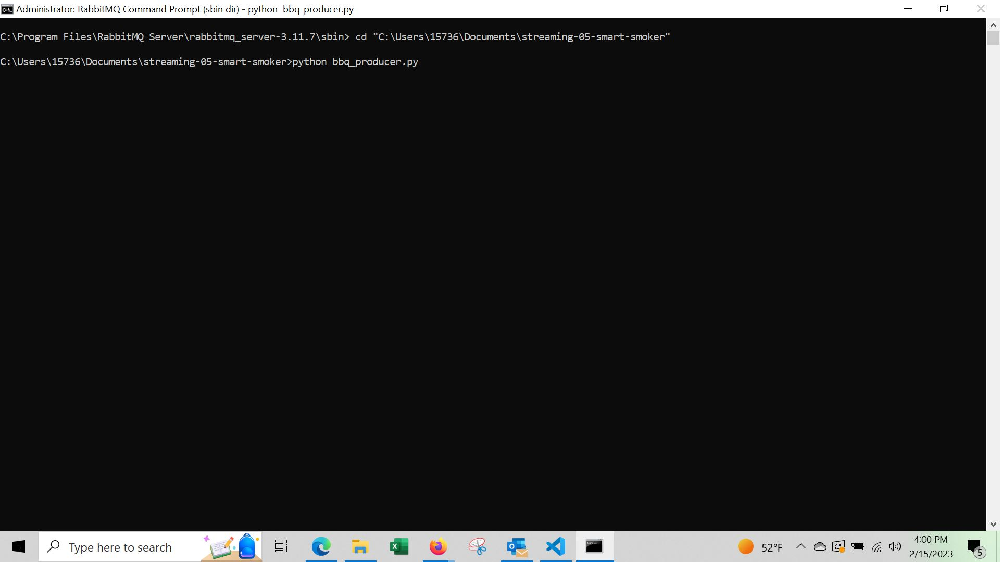

# streaming-05-smart-smoker
Module 5 of Data Streaming

Missy Bernskoetter

We want to stream information from a smart smoker. Read one value every half minute. (sleep_secs = 30)

smoker-temps.csv has 4 columns:

    [0] Time = Date-time stamp for the sensor reading
    [1] Channel1 = Smoker Temp --> send to message queue "01-smoker"
    [2] Channe2 = Food A Temp --> send to message queue "02-food-A"
    [3] Channe3 = Food B Temp --> send to message queue "02-food-B"

Requirements

    RabbitMQ server running
    pika installed in your active environment

RabbitMQ Admin

    See http://localhost:15672/ 

    Links to an external site.

General Design Questions

    How many producers processes do you need to read the temperatures:
    How many queues do we use: 
    How many listening callback functions do we need (Hint: one per queue): 

If that is all you need to get started, you can begin the project now. Apply everything you've learned previously. 
Task 1. Create a Place to Work

    In GitHub, create a new repo for your project - name it streaming-05-smart-smoker
    Add a README.md during the creation process. (If not, you can always add it later.)
    Clone your repo down to your machine. 
    In VS Code, add a .gitignore (use one from an earlier module), start working on the README.md. Create it if you didn't earlier.
    Add the csv data file to your repo. 
    Create a file for your bbq producer.

Task 2. Design and Implement Your Producer

    Implement your bbq producer. More detailed help provided in links below. 
    Use the logic, approach, and structure from Module 4, version 2 and version 3.
    These provide a current and solid foundation for streaming analytics - modifying them to serve your purpose IS part of the assignment.
    Do not start from scratch - do not search for code - do not use a notebook.
    Use comments in the code and repo to explain your work. 
    Use docstring comments and add your name and date to your README and your code files. 
    Explain your project in the README. Include prerequisites and how to run your code. 
    Document your project works - display screenshots of your console and maybe the RabbitMQ console. 
    If you only have a producer, you won't have a consumer showing messages yet, so you'll need to be creative. We'll build the consumers next.

Required Approach

    Use your Module 4 projects (Version 2 and Version 3) as examples.
    Remember: No prior coding experience is required to take this course. Rely heavily on the working examples from earlier modules. 
    The more similar your code looks to the examples - the more credit earned.
    Vastly different approaches can be expected to earn less credit not more.
    This project should clearly build on skills and code we've already mastered. If not, let me know and more help will be provided. 
    The primary difference should be going from 1 to 3 queue_names and from 1 to 3 callbacks. 
    Part of the challenge is to implement analytics using the tools and approach provided (don't significantly refactor the codebase during your first week of work!) 
    AFTER earning credit for the assignment, THEN create and share additional custom projects. 

 
Why? Professional Practice

    At work, you'll be expected to contribute meaningfully and solve a variety of issues on your own.
    You'll also be part of a team. We all need to balance working on our own, and maintaining productivity by asking for help to get past obstacles.
    The goal is to be ready to be onboarded effectively into an existing team, with pre-established ways of doing things.
    At this point in your career, don't get too attached to any preferences.
    Many things will be set by your team lead.
    On a team, you'll likely autoformat your code on commit (have you read about Black?) and use various automatic static analysis tools and linters like Prospector and flake8. Commits may need to pass unit tests before you can push. 
    Focus on being a great team player, able to join a team with little disruption, follow your team's conventions, and begin contributing productively. 

 
More Guidance

    To be guided through the producer design, read Module 5.1: Guided Producer Design.
    For a bit more guidance on the coding implementation, read Module 5.2: Guided Producer Implementation
    Use the discussion forum when you get stuck.
    Try to help without giving away code. 

My notes:
The biggest issue I had with this coding situation was building all three channels. It would not let me run it without having something after the first try with creating the channels. I used the same 'except' as the other trys. It ran this way but I am wondering why it did this because other code I have seen doesn't need it. 
You would need to change the name of the queue to what you want for each section to have your own data built in. I do not have the listening workers built at this time and this is just the emitter. 

Producer screenshot below:
